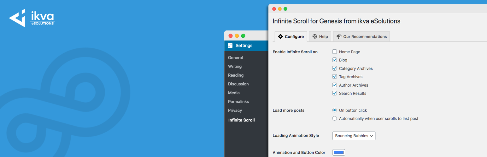
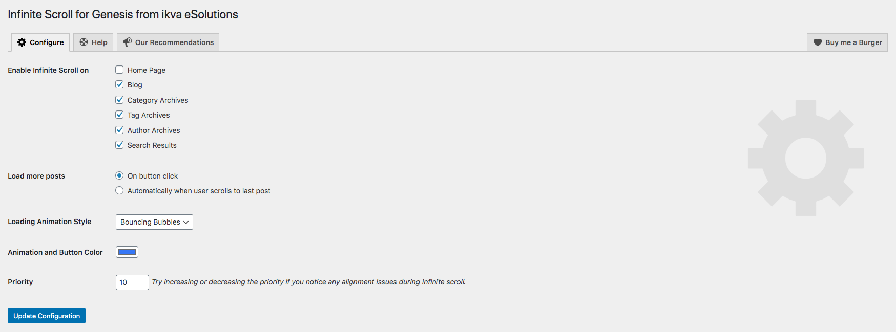
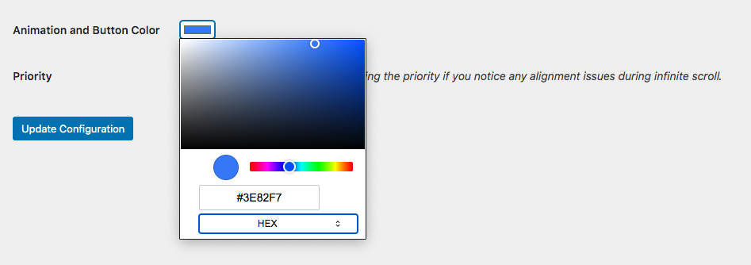

Easily add infinite scroll to your Genesis child themes. You have a couple of options to load more posts on a button click (without page reload) or automatically when the user scrolls to the end of the last post.

10 different loading animations gives you plenty of options to choose from. You can literally set any color to the loading icons that suit your brand color.

[View Demo on Geek Dashboard](https://www.geekdashboard.com/category/news/)

# Features of Infinite Scroll for Genesis:

* Lightweight implementation.
* Flexible options to enable/disable infinite scroll on the home page, blog, tags, categories, author archives, and search results.
* 2 options to load more posts - Either on button click or automatically on the scroll.
* 10 Pure CSS loading animations.
* Infinite color options.
* No CSS files added to your pages.
* Proper conditional checking to execute the plugin only on the selected pages.
* No additional load on your regular posts since infinite scroll on posts is meaningless.
* SEO Friendly. Your regular Pagination (/page/1, /page/2 etc.) still works with proper canonical links.

If you have any questions about our plugin, don't hesitate to contact us from our official website [Geek Dashboard](https://www.geekdashboard.com/)

# How to Install?

The quickest method for installing the WP Droid is:

1. Visit Plugins -> Add New in the WordPress dashboard.
1. Search for `Infinite Scroll for WP` without quotes in the search box.
1. Click "Install".
1. Finally, click `Activate Plugin`.

If you would prefer to do things manually then follow these instructions:

1. Extract the downloaded plugin file.
1. Upload the `infinite-scroll-fpr-wp` folder to the `/wp-content/plugins/` directory
1. Activate the plugin through the 'Plugins' menu in WordPress

# Frequently Asked Questions

#### How does this plugin works
This plugin uses Genesis default hooks and infinite-scroll JavaScript library to enable infinite scroll on selected pages.

#### Will it slows down my site
No, the JavaScript file in hosted locally, and no additional HTTP request to the enteral site is made. We have also taken the utmost care to inline the CSS and JS only when required.

#### Can I use it on any theme?
Currently, our plugin works only on themes running on Genesis Framework. In the future, we'll plan to support more themes. Hopefully!

#### Should I enable infinite scroll everywhere?
Maybe Yes or No. It depends on your preferences and theme design.
If you are using a custom-developed page instead of regular posts layout as your front page/home page, you need to disable infinite scroll on it.

For example, check the home page of the [Geek Dashboard](https://www.geekdashboard.com/). Here we are using a custom-coded front page and infinite scroll is not possible since it is a combination of different sections. However, if you are using the theme's default latest posts as home page, you can enable infinite scroll on it.

#### Loading posts "Automatically on scroll" or "On Button Click". Which one to use and why?
Both options have their own pros and cons. If you have important information in site footer or sidebar(on mobiles), you should use "On Button Click" to load more posts. So the user will have a chance to view your sidebar and footer. If you wish to save a user click and no critical information is available in the sidebar or the footer, you can choose to load posts automatically when the user scrolls to the end of the list.

# Screenshots

# Changelog

#### v1.0.2 (31 July 2020)
* Minor Bug Fixes.

#### v1.0.1 (30 July 2020)
* Minor Bug Fixes.

#### v1.0 (28 July 2020)
* Initial release.
